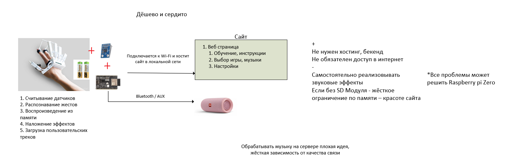
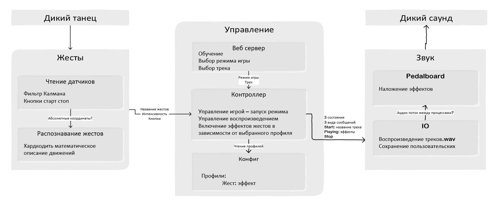

# Художественный проект РУКОБЛУДСТВО

## Используемые технологии

**Софт**
* Python
  * Pedalboard - звуковые эффекты
* PulseAudio драйвер для роутинга звука

**Железо**
* raspberry pi 3b
* Вписать датчики

## Дизайн
  
