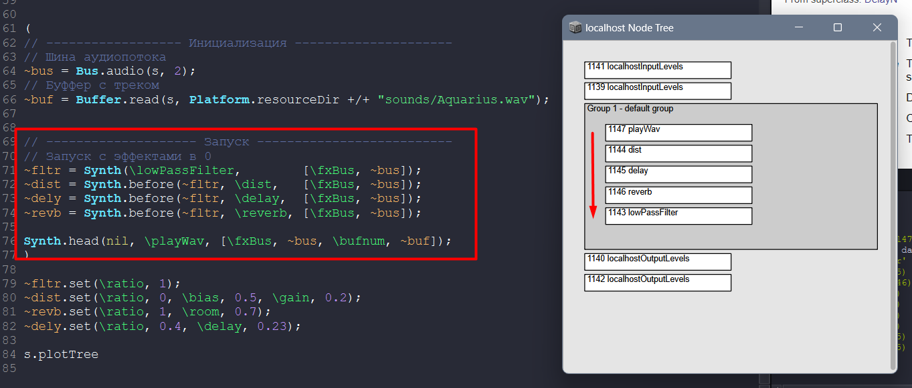

# SoundGloves

## Используемые технологии

**Софт**  
Звук
* ~~Pedalboard, pydub, dawdreamer~~ - не поддерживается на armv6 архитектуре
* ~~pysndfx - обёртка sox~~ - не умеют обрабатывать в реальном времени
* `SuperCollider`
  * `scsynth` – A real-time audio server
  * `sclang` – An interpreted programming language (отдельный вродебы простой ЯП)

**Драйвера**
* `PulseAudio` роутинг звука

**Железо**
* raspberry pi 3b
* Гироскоп MPU6050 или MPU6000

## Дизайн

Текущий роутинг эффектов

# Установка

1. Собрать коллайдер из исходников https://github.com/supercollider/supercollider/blob/develop/README_RASPBERRY_PI.md  
Собирать GUI-less билд, процесс долгий это нормально    
Если на этапе `cmake --build . --config Release --target all -- -j3 # use -j3 flag only on RPi3 or newer` выкинет ошибку  
Всё норм, убрать опцию `-j3` и начать по новой, у меня прокатило  

