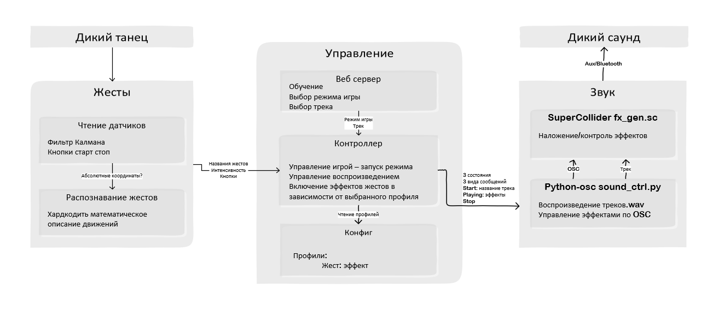

## Сеня:

Звук
- [x] Наложение эффектов во время воспроизведения
    - [x] Проверить ~~pedalboard~~, ~~pydub~~
    - [ ] ~~Разобраться как роутить звук в PulseAudio~~ - лишние движения
- [x] Изменение эффектов при воспроизведении
    - [x] Проверить pysndfx
    - [ ] ~~Проверить `sclang` + `supriya`~~
    - [x] Лоу пасс фильтр
    - [x] Делей
    - [x] Реверберации
    - [x] Овердрайв
- [ ] Допиливание
  - [ ] ~~~`sclang` + `supriya`~~~
    - [ ] ~~Чтение .wav~~
    - [ ] ~~Интерфейс управления эффектами~~    
  **К `Supryia` не подключить расширения (-дисторшн) и в целом ублюдская затея переписывать готовые эффекты на другой ЯП**
  - [ ] Python -> OSC -> scsynth
      - [x] Простой пример с чтением python->OSC сообщений ~~несколькими хендлерами~~
      - [x] Убрать лишнее из sc fx скрипта
      - [x] Запуск, подключение, отключение sc из python
      - [x] Воспроизведение трека
        - [ ] ~~Запуск по пути из SC~~ - не выходит загрузить в буффер внутри синта
        - [x] Перехват обработка звука в SC  
        - [x] Запуск треков из Python  
              **Ньюанс:** звук между программами надо роутить драйверами, отладить на расбе не могу, поэтому для тестов ввожу звук с телефона по AUX и делаю вид что его запустил Python  
        - [ ] _* Наладить PulseAudio_ - должно быть легко но муторно, подождёт
      - [x] Управление эффектами
        - [x] OSC хендлеры на изменение эффектов в sc
        - [x] Отправка OSC сообщений из python
  - [ ] Python глав контроллер stdout -> stdin sound_ctrl.py
    - [ ] Запуск fx_gen.sc
    - [ ] Чтение и обработка stdin скрипта
    - [ ] Главный цикл
- [ ] Портирование и проверка на расбе
  - [ ] Поставить плагин дисторшена
  - [ ] Проверить работу

## ~~Василий~~:

## ~~Артём~~: 

Жесты
  - [ ] Исследовать
    - [ ] Считывание датчиков
        - [ ] Разобраться что придумал Василий
    - [ ] Распозавание жестов
        - [ ] Какие есть алгоритмы и подходы
        - [ ] Сгенерировать данные датчиков для тестов
  - [ ] Сделать (дополняй дальше сам хз чё там во время работы всплывёт)
    - [ ] ...
  
